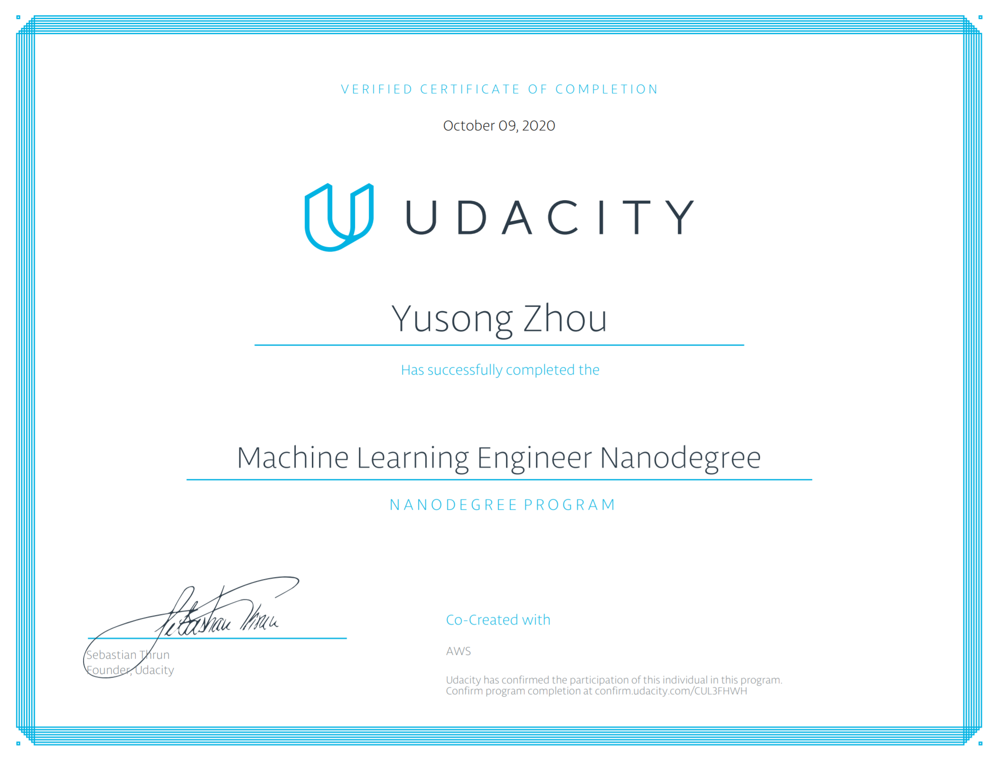

# Machine Learning Engineer Nanodegree



This repository contains files of Udacity's Machine Learning Engineer Nanodegree program. Detailed information of this program can be found at these pages:
- [Program Overview](https://www.udacity.com/course/machine-learning-engineer-nanodegree--nd009t)
- [Program Syllabus](https://s3.amazonaws.com/iridium-content/documents/en-US/machine-learning-engineer-nanodegree-program-syllabus.pdf)

## Prerequisite

- Intermediate Python programming
- Intermediate machine learning algorithms

## Project Overview

- Build and deploy a deep learning model that predicts the sentiment of a user-provided movie review using Amazon SageMaker. In addition, create a simple web app that uses the deployed model and accepts user input;
- Use advanced machine learning skills to define similarity metrics between two text documents and identify cases of plagiarism. Perform feature engineering, train and deploy a custom, plagiarism-classification model using Amazon SageMaker;
- Capstone Project: 	Use both unsupervised and supervised machine learning models to perform customer segmentation analysis and make predictions specific to every individual in the given dataset.